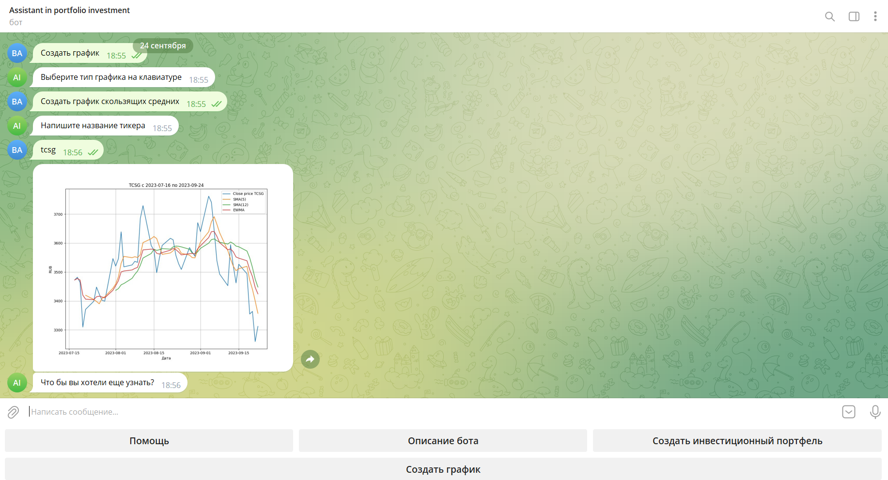

# Investing-Telegram-Bot

## Used technology

<em>The program allows you to create an investment portfolio with maximum profitability and minimum risks, analyze the dynamics of prices for ordinary shares in real time.</em> 

<h3>What can this bot do?</h3>
<ul>
    <li>Get a visual representation of the current dynamics of stocks;</li>
    <li>Create an individual investment portfolio according to the given cost parameters;</li>
    <li>Make an optimal choice of assets based on the required ratio of profitability/risk.</li>
</ul>

    
Start command:
 
     

<h3>Details:</h3>
<ul>
    <li>As a model for determining the structure of the investment portfolio, the model of G. Markowitz was chosen, according to which the portfolio with the minimum risk, the maximum Sharpe ratio and the average portfolio is determined.</li>
    <li>As information visualization are used: 
        1. Moving averages; 
        2. Japanese candles.</li>
    <li>Handled the situation with the attack of spam bots.</li>
</ul>

    <h3>Required to run bot</h3>
    
To start the project, read the small <a href="START.md">manual</a>.

    <h3>Examples</h3>
    
1. Creation of an investment portfolio: 
 
     
    
2. Creating a graph(Japanese candles): 

     
    
3. Creating a graph(Moving averages): 

     

	<h3>License</h3>
	
Apache License 2.0, details here <a href="LICENSE">LICENSE</a>

