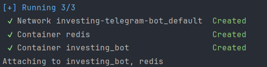

## Launch of the project

    <ul>
        

            <li><h3>Copy the repository</h3>
            <pre>git clone https://github.com/ronik-v/Investing-Telegram-Bot.git</pre></li>
            <li>
                <h3>Create directory</h3>
                <pre>mkdir src/Graphs</pre>
            </li>
            <li>
                <h3>Redis</h3>
                
If you want to change the Redis IP address and port, don't forget to change the connection in src/main.py.

                
Changed parameters should also be specified in <a href="docker-compose.yaml">docker-compose file</a>.

                
Redis runs as a container see <a href="docker-compose.yaml">here</a>.

            </li>
            <li>
                <h3>Use docker-compose file</h3>
                <pre>docker compose up</pre>
                
            </li>
        

    </ul>

